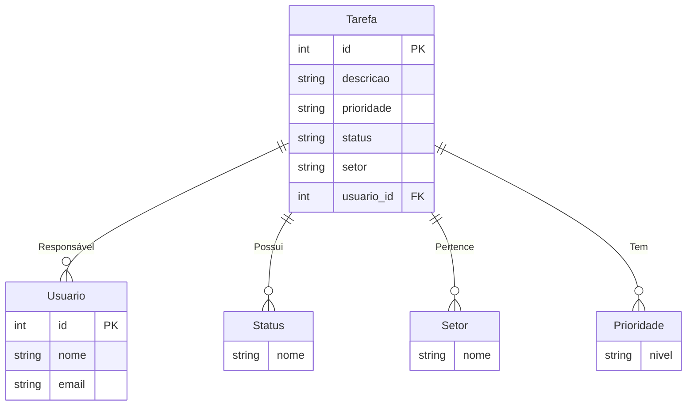

# PraticaSAEP
## Diagrama Entidade-Relacionamento:


## Diagrama de Casos de Uso:
```mermaid
flowchart TD
    A[Administrador] --> B[Cadastrar Tarefa]
    A --> C[Atualizar Status da Tarefa]
    A --> D[Excluir Tarefa]
    A --> E[Visualizar Tarefas]

    B -->[Em seguida] E
    C --> E
    D --> E
    %% Estilo para o ator "Administrador"
    style A fill:#0000FF,stroke:#333,stroke-width:2px
```
## Script do banco de dados PostgreSQL:
            CREATE DATABASE pratica_saep;
Não é necessário criar tabelas, já que estas são criadas automaticamente pelo JPA.
